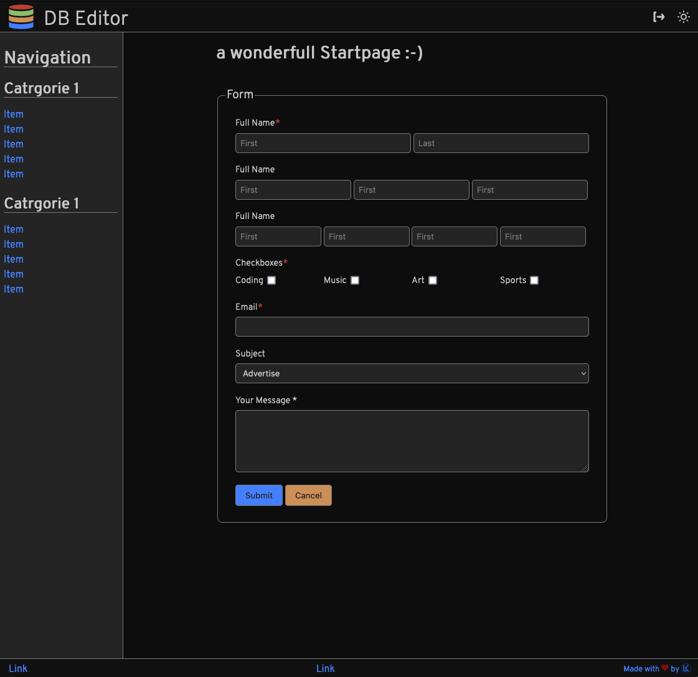

# SvelteKit Layout Template

still learning Svelte stuff...

npx depcruise src --include-only "^src" --config --output-type dot | dot -T svg > dependency-graph.svg

npx depcruise src --include-only "^src" --config --output-type dot | dot -T svg | npx depcruise-wrap-stream-in-html  > dependency-graph.html

## Features

- classically layout with, Header, Footer, Sidebar & Content
- Sidebar is hiding on small screens
- responsive via matchMedia object (`+layout.svelte`)
- dark & light Theme (incl Code-Highlighting)
- ...

## used libraries
- https://github.com/flekschas/svelte-simple-modal
- Modified with `rememberme` switch: 
  https://github.com/joshnuss/svelte-local-storage-store

### tried Libraries
- https://github.com/MacFJA/svelte-persistent-store

## usefull links
- https://geoffrich.net/posts/svelte-$-meanings/
- https://github.com/andrelmlins/svelte-grid-responsive

